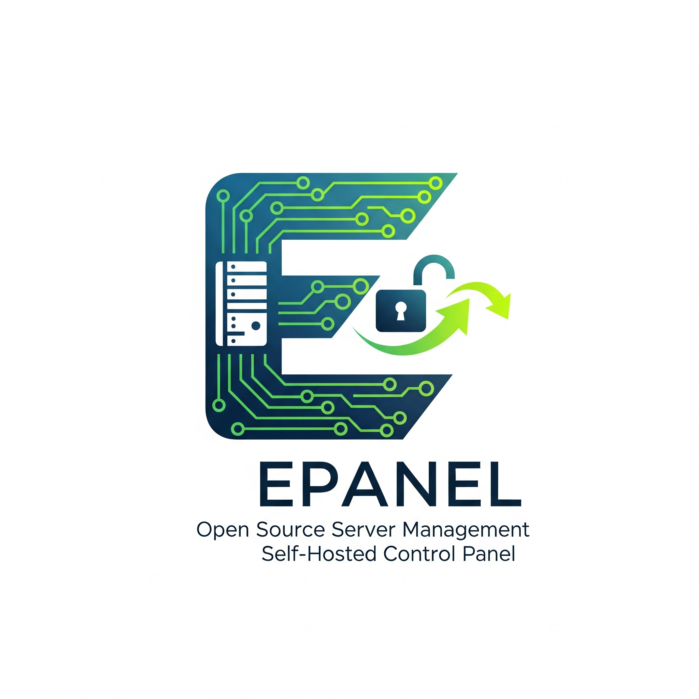

# EPanel

<p align="center">
  
</p>

<h3 align="center">
A modern, powerful, and open-source control panel for managing your servers and
applications, designed for self-hosting.
</h3>

<p align="center">
    <a href="#">
      
    </a>
    <a href="https://github.com/freitaseric/epanel/blob/main/LICENSE">
      
    </a>
    <a href="https://github.com/freitaseric/epanel/stargazers">
      
    </a>
    <a href="#">
      
    </a>
</p>

---

## About The Project

EPanel is a comprehensive solution for developers and hobbyists who want to manage
their Docker-based applications and servers through an intuitive web interface.
Built with a modern, secure, and high-performance tech stack, our primary goal is
to provide a top-tier self-hosting experience that is both powerful and easy to maintain.

This project was born out of a desire for a control panel that is transparent,
community-driven, and built on robust, modern technologies like Kotlin and Rust.

## ✨ Key Features

* **Intuitive Web Interface:** A clean and responsive UI built with React to
manage your services effortlessly.
* **Robust & Scalable API:** A powerful backend powered by Ktor and Kotlin,
designed for performance and reliability.
* **Secure & High-Performance Daemon:** A lightweight system daemon written in
Rust for secure, low-level interaction with the Docker API.
* **Docker-Native Integration:** Full control over containers, volumes, and networks.
* **Real-time Logs & Stats:** Monitor your applications' health and output directly
from the panel.
* **Designed for Self-Hosting:** Full ownership of your data and infrastructure.

## 🛠️ Tech Stack

EPanel is built as a monorepo with three core components:

* **Frontend (Panel):** `React` | `Vite` | `TanStack Router`
* **Backend (API):** `Kotlin` | `Ktor` | `PostgreSQL` | `Redis`
* **System Service (Daemon):** `Rust` | `Docker API (bollard)`

## 📁 Project Structure

This project is a monorepo containing all three services:

```three
/(root)
├── .github/            \# GitHub Actions CI/CD Workflows
├── api/                \# Ktor API (Backend)
├── daemon/             \# Rust Daemon (System Service)
├── public/             \# Static assets for the frontend
├── src/                \# React Panel (Frontend)
├── .cta.json           \# TanStack Start configurations
├── package.json        \# Frontend dependencies
├── bun.lock            \# Frontend dependencies lockfile
├── .gitignore          \# Ignore files and directories for git
├── .markdownlint.json  \# Markdownlint configurations
├── biome.json          \# Linter and formatter configurations
├── CODE_OF_CONDUCT.md  \# Ruleset for contributors
├── components.json     \# ShadCN UI configurations
├── CONTRIBUTING.md     \# How to contribute
├── epanel-logo.png     \# Panel logo
├── index.html          \# The main html file
├── LICENSE             \# The license described file
├── README.md           \# This file
├── tsconfig.json       \# The typescript configurations
└── vite.config.ts      \# The vite configurations

````

## 🚀 Getting Started

This guide will walk you through setting up EPanel for local development.

### Prerequisites

Ensure you have the following tools installed on your system:

* [Git](https://git-scm.com/)
* [Node.js](https://nodejs.org/en/) (v18 or newer)
* [JDK 17](https://www.oracle.com/java/technologies/javase/jdk17-archive-downloads.html)
(or newer)
* [Rust & Cargo](https://www.rust-lang.org/tools/install)
* [Docker](https://www.docker.com/products/docker-desktop/)
* [PostgreSQL](https://www.postgresql.org/download/)
* [Redis](https://redis.io/docs/getting-started/)

### Installation Guide

1. **Clone the Repository**

    ```sh
    git clone [https://github.com/freitaseric/epanel.git](https://github.com/freitaseric/epanel.git)
    cd epanel
    ```

2. **Configuration**
    This project uses environment files for configuration. You'll need to set up
    the config for the API.

    ```sh
    # In the /api directory
    cp .env.example .env
    ```

    Now, edit the newly created `.env` file to match your local database, Redis,
    and other settings.

3. **Run the Backend (API)**
    The API requires the PostgreSQL and Redis instances to be running.

    ```sh
    cd api
    ./gradlew run
    ```

    The API should now be running, typically on port `8080`.

4. **Run the System Daemon**
    The Daemon requires Docker and Redis to be running.

    ```sh
    cd daemon
    cargo run --release
    ```

    The Daemon will connect to Redis and wait for commands from the API.

5. **Run the Frontend (Panel)**
    Navigate back to the project root to run the web interface.

    ```sh
    # From the root directory
    npm install
    npm run dev
    ```

    The EPanel should now be accessible in your browser at `http://localhost:3000`
    (or the port specified by Vite).

## 🤝 Contributing

Contributions are what make the open-source community such an amazing place to
learn, inspire, and create. Any contributions you make are **greatly appreciated**.

Please read `CONTRIBUTING.md` for details on our code of conduct and the process
for submitting pull requests.

## 📄 License

This project is licensed under the **AGPL-3.0 License**. See the `LICENSE` file
for more details.
